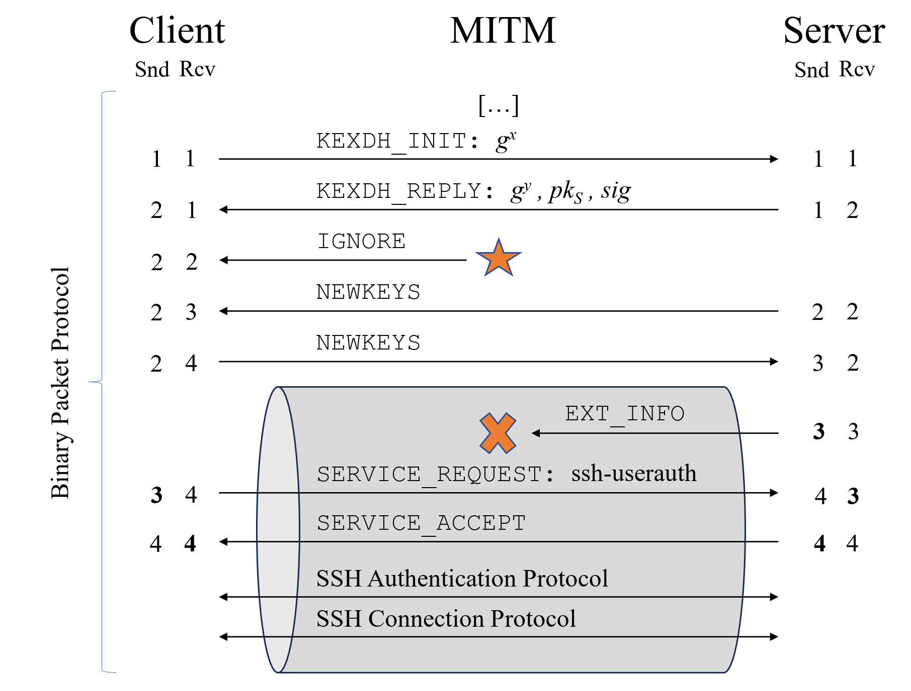

# go-scan-ssh

*go-scan-ssh* is a small utility program written in Go, which can be used to determine the vulnerability of an SSH client or server.
The vulnerability scanner requires a single connection with the peer to gather all supported algorithms.
However, it does not perform a fully fledged SSH key exchange, will never attempt authentication on a server, and does not perform the attack in practice.
Instead, vulnerability is determined by checking the supported algorithms and support for known countermeasures (strict key exchange).
This may falsely claim vulnerability in case the peer supports countermeasures unknown to this tool.



## Usage

```bash
# Scan the SSH server available at localhost port 2222
./go-scan-ssh --connect localhost:2222

# If no port is specified, the tool will default to port 22 instead
./go-scan-ssh --connect localhost

# To scan an SSH client, specify the listen command instead
# After running the command, you will need to connect with your SSH client to port 2222
./go-scan-ssh --listen 0.0.0.0:2222

# When binding to localhost, you can omit the interface address
# The following command will listen for incoming connections on 127.0.0.1:2222
./go-scan-ssh --listen 2222
```

The scanner supports outputting the scan result as json.
To do so, provide the `--json` flag when calling the scanner. The output is structured as follows:

```json
{
  "Banner": "SSH-2.0-DevSolux",
  "SupportsChaCha20": true,
  "SupportsCbcEtm": false,
  "SupportsStrictKex": true,
  "Vulnerable": false
}
```
